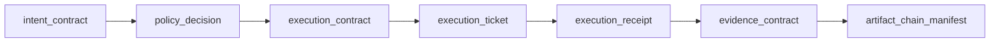
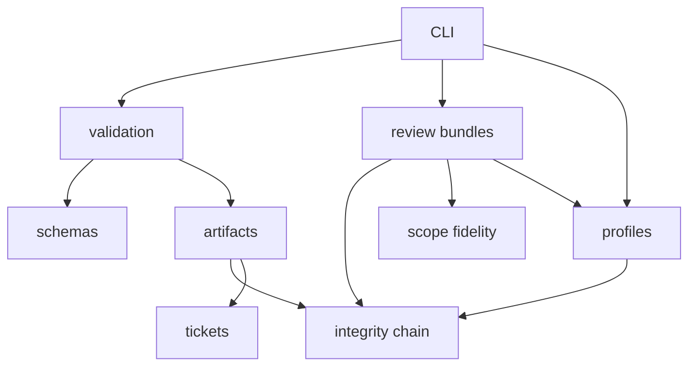
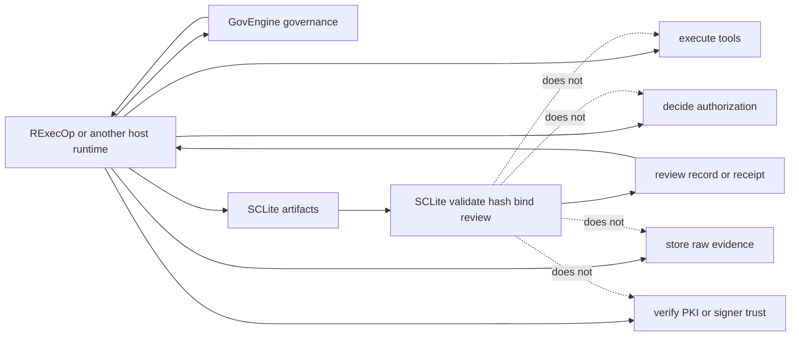

# SCLite

[](https://github.com/rozmiarD/SCLite/actions/workflows/ci.yml)
[](https://pypi.org/project/sclite-core/1.0.9/)
[](pyproject.toml)
[](schemas/)
[](LICENSE)

Lightweight Security Contract Layer for auditable operation lifecycles.

SCLite's canonical lifecycle separates what an agent or caller wants, what
policy allows, what was approved, what was executed, and what can be proven.
It is the stack truth layer: it defines, validates, hashes, binds, redacts,
reviews, and verifies artifacts without becoming a runtime, scheduler,
governance authority, domain profile, PKI authority, or raw-evidence store.

## Status

- Version: `1.0.10rc1`
- Status: **unpublished 1.0.10rc1 hotfix candidate; the published 1.0 source and PyPI stable line remains the frozen lifecycle/review and guarded verification surface**
- Latest published PyPI package: `sclite-core==1.0.9`
- Runtime execution: out of scope; owned by RExecOp or another host runtime
- Protocol/carrier adapters: out of scope; owned by host/runtime integrations
- Integrity: canonical SHA-256 artifact descriptors + ordered hash-linked lifecycle manifest
- Identity/PKI: out of scope for core; owned by the host/governance trust domain

SCLite's core is a **contract/review lifecycle**, not an execution engine.
Runtimes such as RExecOp can consume SCLite artifacts and enforce tickets, but
executors, sandboxes, policy engines, raw evidence storage, agent loops, and
carrier adapters stay outside this package.

## Project sentence

> SCLite separates what an agent wants, what policy allows, what was approved, what was executed, and what can be proven.

## Stack position

| Layer | Ownership |
| --- | --- |
| SCLite | truth, contracts, evidence metadata, receipts, review bundles, digest binding, validation |
| GovEngine | governance, admission, policy decisions, obligations, constraints, enforcement planning |
| RExecOp | domain-neutral lifecycle runner, execution mechanics, connectors, reactions, scheduling, event intake |
| Tecrax and other profiles | domain semantics, intent catalogs, workflow definitions, finding taxonomy, runbooks |

Detailed package/surface history lives in [`ROADMAP.md`](ROADMAP.md) and
[`docs/ARTIFACTS.md`](docs/ARTIFACTS.md). Schema-version compatibility lives in
[`docs/SCHEMA_COMPATIBILITY.md`](docs/SCHEMA_COMPATIBILITY.md).

## What problem does SCLite solve?

AI-assisted security workflows often blur separate authority boundaries:

1. a model proposes intent;
2. policy/scope decides whether the request may proceed;
3. code prepares a concrete execution shape;
4. an auditor/reviewer approves or rejects that shape;
5. a runtime executes or dry-runs under bounds;
6. evidence is summarized for review.

SCLite turns those steps into small schema-backed JSON artifacts and verifies their integrity locally. A reviewer can check the public-safe bundle without running live targets or reading private logs.

The canonical lifecycle keeps each authority boundary visible:



## v0.2 canonical lifecycle

```text
intent_contract -> policy_decision -> execution_contract -> execution_ticket -> execution_receipt -> evidence_contract -> artifact_chain_manifest
```

Current v0.2 artifacts:

| Artifact | Purpose |
| --- | --- |
| `IntentContract` | Captures what an agent/caller wants before authority exists. |
| `PolicyDecision` v0.2 | Captures allow/deny/review policy outcome bound to intent. |
| `ExecutionContract` | Captures the exact bounded execution shape prepared for review. |
| `ExecutionTicket` | Captures approval for one exact execution contract under explicit bounds and validity. |
| `ExecutionReceipt` v0.2 | Captures what an external runtime reports as executed or dry-run. |
| `EvidenceContract` | Captures public-safe claims, non-claims, replay, verification, and evidence links. |
| `ArtifactChainManifest` | Ordered tamper-evident hash chain over lifecycle artifacts. |

SCLite also defines bounded decision-chain artifacts used by host runtimes:
`observation_envelope.v0.1`, `finding.v0.1`, `reaction_plan.v0.1`,
`trigger_decision.v0.1`, `watchdog_decision.v0.1` and
`automation_chain.v0.1`. `automation_chain.v0.1` is the multi-step automation
contract baseline: it records nodes, edges, GovEngine admission refs,
idempotency keys, depth/reaction budgets, recovery policy and LLM
proposal-only invariants. It does not traverse the graph, schedule work,
authorize child operations or execute anything.

Verify the lifecycle fixture:

```bash
sclite validate-chain sclite/examples/contract-lifecycle-v0.2/artifact_chain_manifest.json
sclite verify-lifecycle sclite/examples/contract-lifecycle-v0.2/artifact_chain_manifest.json
```

`validate-chain` verifies the ordered hash-chain. `verify-lifecycle` applies
the lifecycle gate on top and requires the exact canonical v0.2 role sequence
with no extra roles, duplicate roles, or changed order.

The summary output intentionally distinguishes these postures:

- `validate-chain ...` reports `posture=integrity_only` and
  `lifecycle_not_checked`;
- `verify-lifecycle ...` and `validate-chain --strict-lifecycle ...` report
  `posture=strict_lifecycle` after lifecycle semantics pass.

## What the verifiers check

The v0.2 `validate-chain` verifier checks local chain integrity:

- manifest paths cannot escape the artifact root;
- artifact descriptors match canonical SHA-256 digests;
- hash-chain links and root digest recompute correctly.

`verify-lifecycle` and `validate-chain --strict-lifecycle` add strict lifecycle
semantics:

- lifecycle artifacts must appear in the canonical order;
- no extra roles, duplicate roles, or reordered lifecycle roles are accepted;
- policy, execution contract, ticket, receipt, and evidence digest links are
  checked across the lifecycle.
- policy binds the correct intent digest;
- ticket binds the correct execution contract digest;
- receipt binds the correct execution ticket and execution contract digests;
- evidence contract binds the correct receipt and execution ticket digests.
- each canonical lifecycle role carries the expected artifact type,
  `schema_version`, and packaged `schema_ref` for strict/secure profiles.

Loose `validate-chain` keeps compatibility for generic hash-chain manifests.
It may report duplicate, missing, or extra lifecycle roles in JSON, but those
role-shape findings become fail-closed only when strict lifecycle is requested.

## JSON Schema validation modes

SCLite has two validation modes:

| Mode | Dependency | Intended use | Boundary |
| --- | --- | --- | --- |
| dependency-free subset validator | none | fast/offline local checks and minimal installs | only supports the keyword subset SCLite implements directly |
| strict Draft 2020-12 validator | optional `jsonschema` extra | CI, release gates, and reviewer validation | uses `jsonschema.Draft202012Validator` |

The default CLI path preserves the zero-runtime-dependency package. Release and CI validation must also run strict mode through `scripts/strict_schema_gate.sh`. See [SCLite Validation](VALIDATION.md) for the supported keyword table and strict-mode commands.

## What SCLite is

SCLite core is limited to:

```text
define / validate / hash / bind / redact / review / verify
```

The review-bundle shape first published on the 0.5.x line remains part of the
current lifecycle/review front door: it packages lifecycle artifacts, review
records, and verification receipts for local public-safe review. The
scoped-ticket surface still bounds what a runtime may consume, and
`verify-ticket-use` checks that public-safe evidence stays inside the linked
receipt. Review records and guarded secure-bundle verification now consume
that same static ticket-use check when v0.3 ticket, receipt, and evidence
artifacts are present. See [`ROADMAP.md`](ROADMAP.md).

It provides:

- JSON schemas for current lifecycle, review, profile, and publication-hygiene artifacts;
- deterministic artifact hashing helpers;
- v0.2 lifecycle/chain verification;
- scoped-ticket review helpers (`validate-ticket`, `explain-ticket`);
- ticket-use / receipt-bounded-evidence checks (`verify-ticket-use`);
- digest-bound trust/carrier profile reference checks (`validate-trust-profile`, `validate-carrier-profile`);
- lifecycle review records and Scope Fidelity v0.2 checks (`review-lifecycle`);
- canonical review-bundle validation and Markdown export (`review`, `export-review-bundle`);
- redaction/public-snapshot helper artifacts;
- a CLI for local validation and review fixtures.

The package stays centered on local validation, review, profile references, and integrity checks:



## Out of Scope

SCLite intentionally does not own:

| Capability | Owner |
| --- | --- |
| Execution, subprocess handling, connectors, scheduler/event intake, reaction loop | RExecOp or another host runtime |
| Governance, admission, policy decisions, obligations, constraints, human sign-off gates | GovEngine |
| Infrastructure/security/business semantics, findings, runbooks, target taxonomy | Tecrax, Ravenclaw, or another domain profile |
| Raw evidence storage, secret storage, replay store, operational logs | Host/operator infrastructure |
| Signer identity, PKI trust, KMS, transparency log guarantees | Host/governance trust domain |
| Legal authorization or proof of live vulnerability evidence | Operator/governance process |

Execution, raw evidence storage, and concrete trust verification belong to the
host runtime. Governance and admission belong to GovEngine:



## Retired proof-trace path

The older public-safe proof trace was a migration source during alpha
development. It is out of scope for the installed/current SCLite surface.
Ravenclaw moved its public proof projection to the current
lifecycle/review-bundle model; retained schema identifiers such as
`review_record.v0.1` identify current formats and are not compatibility product
lines.

See [`SPEC.md`](SPEC.md) for the canonical model, artifact definitions,
integrity chain, compatibility notes, and explicit security boundaries. See
[`SECURITY_MODEL.md`](SECURITY_MODEL.md) and
[`docs/SECURITY_PROFILES.md`](docs/SECURITY_PROFILES.md) for the frozen
security profile meanings, Kernel Guard transcript/canonicalization freeze,
and replay/non-claim boundaries for the 1.0 release line.

## Project docs

- [`ROADMAP.md`](ROADMAP.md) — versioned accountability-layer evolution and post-0.5 direction.
- [`SECURITY_MODEL.md`](SECURITY_MODEL.md) — security guarantees, non-claims, Kernel Guard transcript freeze, replay boundary, and key-rotation boundary.
- [`docs/SECURITY_PROFILES.md`](docs/SECURITY_PROFILES.md) — stable profile matrix for `integrity_only`, `strict_lifecycle`, `guarded_domain_auth`, `guarded-strict`, and host-owned freshness.
- [`docs/PUBLIC_API.md`](docs/PUBLIC_API.md) — frozen top-level Python API exports for the 1.0 line.
- [`docs/SCHEMA_COMPATIBILITY.md`](docs/SCHEMA_COMPATIBILITY.md) — schema-version matrix, unknown-field policy, artifact ID guidance, and GovEngine compatibility notes.
- [`docs/TRUST_PROFILES.md`](docs/TRUST_PROFILES.md) — digest-bound trust reference profiles without PKI/trust authority ownership.
- [`docs/CARRIER_PROFILES.md`](docs/CARRIER_PROFILES.md) — digest-bound carrier reference profiles without adapter/transport ownership.
- [`docs/REVIEW_RECORDS.md`](docs/REVIEW_RECORDS.md) — static lifecycle review records and Scope Fidelity v0.2.
- [`docs/REVIEW_BUNDLES.md`](docs/REVIEW_BUNDLES.md) — canonical v0.5 review-bundle shape and CLI.
- [`docs/GOVENGINE_INTEGRATION_CONTRACT.md`](docs/GOVENGINE_INTEGRATION_CONTRACT.md) — current SCLite imports, CLI surfaces, and fixtures for GovEngine.
- [`docs/SCLITE_0_5_FREEZE.md`](docs/SCLITE_0_5_FREEZE.md) — 0.5.x freeze notes and non-goals.
- [`docs/CLI_EXIT_CODES.md`](docs/CLI_EXIT_CODES.md) — CLI exit-code contract for CI/downstream callers.
- [`docs/THREAT_MODEL.md`](docs/THREAT_MODEL.md) — concrete tampering, boundary, and non-goal model.
- [`PUBLIC_STATUS.md`](PUBLIC_STATUS.md) — current maturity and non-claims.
- [`VALIDATION.md`](VALIDATION.md) — local validation and build gates.
- [`PUBLICATION_CHECKLIST.md`](PUBLICATION_CHECKLIST.md) — release/publication checklist.
- [`CHANGELOG.md`](CHANGELOG.md) — notable package changes.
- [`CONTRIBUTING.md`](CONTRIBUTING.md) — contribution and boundary rules.
- [`SECURITY.md`](SECURITY.md) — security reporting and fixture-safety policy.

## Installation

Install the latest published package from PyPI with an exact version pin:

```bash
python -m pip install sclite-core==1.0.9
```

Install directly from GitHub:

```bash
pip install git+https://github.com/rozmiarD/SCLite.git
```

From a local checkout:

```bash
python -m venv .venv
. .venv/bin/activate
python -m pip install -e '.[dev]'
```

Runtime dependencies are intentionally empty. The `dev` extra installs `pytest` for local tests.
Python import package remains `sclite`.

Run the canonical local development gate:

```bash
scripts/dev_gate.sh
```

## CLI quickstart

Validate the v0.2 lifecycle chain:

```bash
sclite validate-chain sclite/examples/contract-lifecycle-v0.2/artifact_chain_manifest.json
sclite verify-lifecycle sclite/examples/contract-lifecycle-v0.2/artifact_chain_manifest.json
```

Use `sclite validate-chain --strict-lifecycle ...` when a generic chain check
should also fail closed on the canonical lifecycle role sequence.

Optionally verify a GovEngine/KERNEL-domain guard sidecar:

```bash
SCLITE_KERNEL_GUARD_KEY='local-test-secret' \
  sclite verify-guarded-chain \
  sclite/examples/contract-lifecycle-v0.2/artifact_chain_manifest.json \
  --guard /path/to/kernel_guard_manifest.json \
  --strict-lifecycle
```

`kernel_guard_hmac_v1` authenticates a manifest and its entries only inside the
domain that knows the HMAC secret. It is not PKI, non-repudiation, public
identity, replay prevention, or proof that a runtime behaved correctly.
When `--guard` is provided explicitly, SCLite resolves it relative to the
current working directory, not relative to the bundle directory. Omitting
`--guard` uses `kernel_guard_manifest.json` next to the manifest or review
bundle target.

For runtime-consumable guarded bundles, use the fail-closed secure profile
instead of assembling the weaker pieces manually. The guard sidecar is produced
by the trusted host/GovEngine domain and is not committed in the public example
bundle:

```bash
SCLITE_KERNEL_GUARD_KEY='local-test-secret' \
  sclite verify-secure-bundle examples/govengine-integration \
  --guard /path/to/kernel_guard_manifest.json
```

`verify-secure-bundle` is the `guarded-strict` profile. It always verifies the
artifact chain, requires the exact lifecycle role sequence, requires
`kernel_guard_hmac_v1`, binds manifest metadata, and fails when the guard is
missing. It still does not check replay freshness; GovEngine owns
`guarded_domain_auth_fresh` by recording `root_tag` reuse.

JSON output includes a stable `verification_result` object with explicit layer
statuses:

```json
{
  "artifact_chain": "pass",
  "strict_lifecycle": "pass",
  "kernel_guard": "pass",
  "replay": "not_checked",
  "public_identity": "not_claimed",
  "runtime_enforcement": "not_claimed"
}
```

The `verification_result.v1` contract makes SCLite's non-claims
machine-readable; it does not add replay state, public identity, or runtime
enforcement.

Security posture modes:

- `integrity_only`: local SHA-256 artifact-chain consistency only.
- `strict_lifecycle`: integrity plus exact lifecycle roles, no extras,
  duplicates, or reorder.
- `guarded_domain_auth`: strict lifecycle plus HMAC authenticity inside the
  domain that knows the secret.
- `guarded_domain_auth_fresh`: HMAC authenticity plus GovEngine replay-store
  freshness.
- `public_signed_export`: future public signature/export mode, not implemented
  in this release.

Validate and explain the v0.3 scoped-ticket fixture:

```bash
sclite validate-ticket \
  sclite/examples/scoped-ticket-v0.3/execution_ticket.json \
  --contract sclite/examples/scoped-ticket-v0.3/execution_contract.json
sclite explain-ticket sclite/examples/scoped-ticket-v0.3/execution_ticket.json
sclite verify-ticket-use \
  sclite/examples/scoped-ticket-v0.3/execution_ticket.json \
  --contract sclite/examples/scoped-ticket-v0.3/execution_contract.json \
  --receipt sclite/examples/scoped-ticket-v0.3/execution_receipt.json \
  --evidence-contract sclite/examples/scoped-ticket-v0.3/evidence_contract.json
```

Validate one artifact against a schema:

```bash
sclite validate-artifact \
  --schema execution_contract.v0.2 \
  examples/review-bundle/03_execution_contract.json
```

Use strict Draft 2020-12 validation with the optional `jsonschema` extra:

```bash
pip install 'sclite-core[jsonschema]'
sclite validate-artifact \
  --strict-jsonschema \
  --schema execution_contract.v0.2 \
  examples/review-bundle/03_execution_contract.json
```

Hash one artifact with deterministic SCLite canonical JSON + SHA-256:

```bash
sclite hash-artifact \
  --schema execution_contract.v0.2 \
  examples/review-bundle/03_execution_contract.json
```

Generate a standalone Scope Fidelity report from explicit dry-run shape facts:

```bash
sclite scope-fidelity \
  --target https://example.com/login \
  --normalized-arg https://example.com/login \
  --fail-on review
```

Review and export the v0.5 review-bundle fixture:

```bash
sclite review examples/review-bundle --format json
sclite export-review-bundle examples/review-bundle --format markdown
```

Review bundles package the lifecycle chain into a reviewer-facing record and optional Markdown export:


Review the GovEngine integration-readiness fixture and enforce conservative CI thresholds:

```bash
sclite review examples/govengine-integration --format json --fail-on review
sclite validate-trust-profile examples/govengine-integration/trust_profile_ref.json --subject examples/govengine-integration/04_execution_ticket.json
sclite validate-carrier-profile examples/govengine-integration/carrier_profile_ref.json --subject examples/govengine-integration/04_execution_ticket.json
```

Run tests:

```bash
python -m pytest -q
```

## Python usage

Verify a v0.2 lifecycle manifest:

```python
from sclite.integrity import verify_artifact_chain_manifest

# Load artifact_chain_manifest.json as a dict and verify it against a local root.
result = verify_artifact_chain_manifest(manifest, root=fixture_dir)
assert result["status"] == "passed"
```

Review scoped-ticket / receipt-bounded-evidence fixtures:

```python
from sclite.tickets import validate_ticket_semantics, verify_ticket_use

checks = validate_ticket_semantics(ticket, execution_contract)
assert "ticket_scope_matches_execution_contract" in checks

result = verify_ticket_use(ticket, execution_contract, execution_receipt, evidence_contract)
assert "evidence_claims_bounded_by_receipt" in result["checks"]
```

Review a canonical v0.5 bundle:

```python
from sclite.bundles import review_bundle

record = review_bundle("examples/govengine-integration")
assert record["verdict"] == "pass"
```

## Repository layout

```text
sclite/                         Python package
sclite/schemas/                 Packaged schemas
sclite/examples/contract-lifecycle-v0.2/
sclite/examples/review-bundle/  Packaged v0.5 review-bundle fixture
sclite/examples/govengine-integration/ Packaged downstream integration fixture
examples/review-bundle/         Public v0.5 review-bundle fixture
examples/govengine-integration/ Public GovEngine integration-readiness fixture
schemas/                        Source schema copies
SPEC.md                         Current public specification
CHANGELOG.md                    Release notes
```

## License

MIT. See [`LICENSE`](LICENSE).
