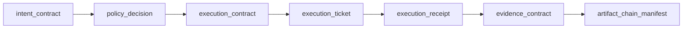
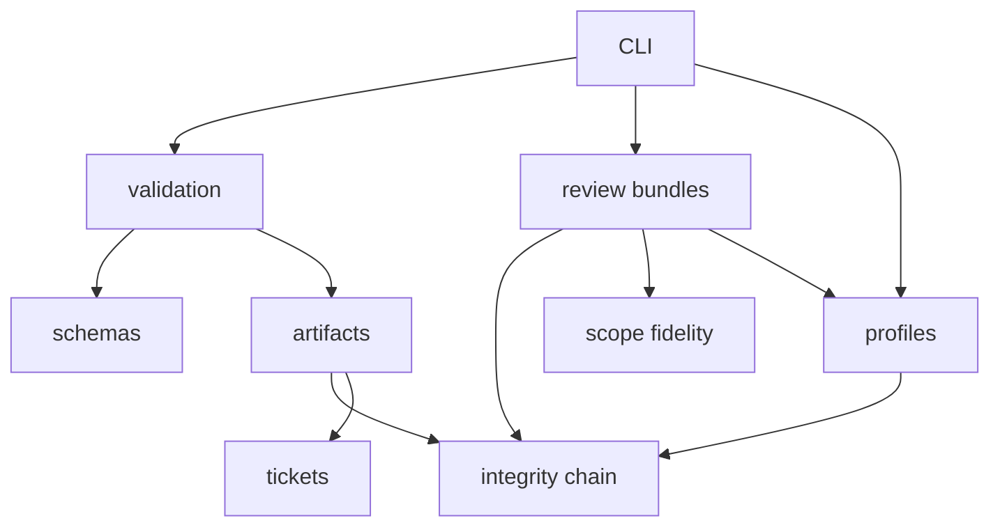
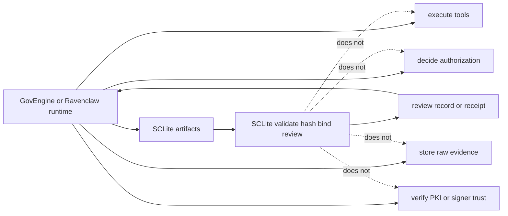

# SCLite

[](https://github.com/rozmiarD/SCLite/actions/workflows/ci.yml)
[](https://pypi.org/project/sclite-core/0.8.0a0/)
[](pyproject.toml)
[](schemas/)
[](LICENSE)

Lightweight Security Contract Layer for auditable AI/security contract lifecycles.


SCLite's canonical lifecycle separates what an agent wants, what policy allows,
what was approved, what was executed, and what can be proven. The 0.8 beta
candidate freezes one review-lifecycle/review-bundle front door and lets active consumers
materialize a canonical review bundle without adding runtime, adapter, PKI, or
policy authority. The superseded proof-trace product path has been retired.

## Status

- Version: `0.8.0b0`
- Status: **unpublished 0.8 beta candidate: frozen lifecycle/review surface**
- Latest published package: `sclite-core==0.8.0a0` (`0.8.0-alpha`)
- Runtime execution: not included
- Protocol/carrier adapters: not included
- Integrity: canonical SHA-256 artifact descriptors + ordered hash-linked lifecycle manifest
- Identity/PKI: not included in core

SCLite's core is a **contract/review lifecycle**, not an execution engine. Runtimes such as Ravenclaw can consume SCLite artifacts and enforce tickets, but executors, sandboxes, policy engines, raw evidence storage, agent loops, and carrier adapters stay outside this package.

## Project sentence

> SCLite separates what an agent wants, what policy allows, what was approved, what was executed, and what can be proven.

## Version surface map

| Surface | Role | Current status |
| --- | --- | --- |
| legacy proof trace | Superseded public-safe proof fixtures and validation receipts | Retired from the installed/current surface in published 0.8 alpha |
| v0.2 lifecycle | Canonical intent → policy → contract → ticket → receipt → evidence chain | Canonical lifecycle model |
| v0.3 scoped tickets | Runtime-consumable ticket semantics and receipt-bounded evidence checks | Available via `validate-ticket`, `explain-ticket`, `verify-ticket-use` |
| v0.4 references/review records | Digest-bound trust/carrier references and lifecycle review records | Available via profile validators and `review-lifecycle` |
| v0.5 review bundles | Packaged lifecycle artifacts plus reviewer Markdown and verification receipt | Current frozen review surface |
| v0.6 alpha substrate | Public truth gate plus GovEngine and local-admin/Tecrax-style fixtures | Delivered predecessor fixture substrate |
| v0.7 alpha surface collapse | Curated lifecycle/review-bundle root API plus materialization for active consumers | Delivered migration baseline |
| v0.8 alpha legacy retirement | Removes the superseded proof-trace product path after consumer migration | Published predecessor baseline |
| v0.8 beta surface freeze | Freezes the lifecycle/review front door with retained contract identifiers | Unpublished source candidate |

## What problem does SCLite solve?

AI-assisted security workflows often blur separate authority boundaries:

1. a model proposes intent;
2. policy/scope decides whether the request may proceed;
3. code prepares a concrete execution shape;
4. an auditor/reviewer approves or rejects that shape;
5. a runtime executes or dry-runs under bounds;
6. evidence is summarized for review.

SCLite turns those steps into small schema-backed JSON artifacts and verifies their integrity locally. A reviewer can check the public-safe bundle without running live targets or reading private logs.

The canonical lifecycle keeps each authority boundary visible:



## v0.2 canonical lifecycle

```text
intent_contract -> policy_decision -> execution_contract -> execution_ticket -> execution_receipt -> evidence_contract -> artifact_chain_manifest
```

Current v0.2 artifacts:

| Artifact | Purpose |
| --- | --- |
| `IntentContract` | Captures what an agent/caller wants before authority exists. |
| `PolicyDecision` v0.2 | Captures allow/deny/review policy outcome bound to intent. |
| `ExecutionContract` | Captures the exact bounded execution shape prepared for review. |
| `ExecutionTicket` | Captures approval for one exact execution contract under explicit bounds and validity. |
| `ExecutionReceipt` v0.2 | Captures what an external runtime reports as executed or dry-run. |
| `EvidenceContract` | Captures public-safe claims, non-claims, replay, verification, and evidence links. |
| `ArtifactChainManifest` | Ordered tamper-evident hash chain over lifecycle artifacts. |

Verify the lifecycle fixture:

```bash
sclite validate-chain sclite/examples/contract-lifecycle-v0.2/artifact_chain_manifest.json
sclite verify-lifecycle sclite/examples/contract-lifecycle-v0.2/artifact_chain_manifest.json
```

`verify-lifecycle` uses the same underlying verifier as `validate-chain`; the command name exists because it describes the v0.2 review action more clearly.

## What the verifier checks

The v0.2 verifier checks more than raw hashes:

- manifest paths cannot escape the artifact root;
- artifact descriptors match canonical SHA-256 digests;
- hash-chain links and root digest recompute correctly;
- lifecycle artifacts appear in the canonical order;
- policy binds the correct intent digest;
- ticket binds the correct execution contract digest;
- receipt binds the correct execution ticket and execution contract digests;
- evidence contract binds the correct receipt and execution ticket digests.

## JSON Schema validation modes

SCLite has two validation modes:

| Mode | Dependency | Intended use | Boundary |
| --- | --- | --- | --- |
| dependency-free subset validator | none | fast/offline local checks and minimal installs | only supports the keyword subset SCLite implements directly |
| strict Draft 2020-12 validator | optional `jsonschema` extra | CI, release gates, and reviewer validation | uses `jsonschema.Draft202012Validator` |

The default CLI path preserves the zero-runtime-dependency package. Release and CI validation must also run strict mode through `scripts/strict_schema_gate.sh`. See [SCLite Validation](VALIDATION.md) for the supported keyword table and strict-mode commands.

## What SCLite is

SCLite core is limited to:

```text
define / validate / hash / bind / redact / review / verify
```

The review-bundle shape first published on the 0.5.x line remains part of the
current lifecycle/review front door: it packages lifecycle artifacts, review
records, and verification receipts for local public-safe review. The
scoped-ticket surface still bounds what a runtime may consume, and
`verify-ticket-use` checks that public-safe evidence stays inside the linked
receipt. See [`ROADMAP.md`](ROADMAP.md).

It provides:

- JSON schemas for current lifecycle, review, profile, and publication-hygiene artifacts;
- deterministic artifact hashing helpers;
- v0.2 lifecycle/chain verification;
- scoped-ticket review helpers (`validate-ticket`, `explain-ticket`);
- ticket-use / receipt-bounded-evidence checks (`verify-ticket-use`);
- digest-bound trust/carrier profile reference checks (`validate-trust-profile`, `validate-carrier-profile`);
- lifecycle review records and Scope Fidelity v0.2 checks (`review-lifecycle`);
- canonical review-bundle validation and Markdown export (`review`, `export-review-bundle`);
- redaction/public-snapshot helper artifacts;
- a CLI for local validation and review fixtures.

The package stays centered on local validation, review, profile references, and integrity checks:



## What SCLite is not

SCLite is not:

- a security scanner;
- an executor;
- a sandbox;
- a full policy engine;
- an approval authority by itself;
- an agent loop;
- a tool wrapper package for `nmap`, `ffuf`, etc.;
- an MCP/OpenClaw/A2A protocol replacement;
- a proof of legal authorization;
- a proof of live vulnerability evidence;
- a proof of signer identity or PKI trust;
- a tamper-proof transparency log.

Execution, authorization, raw evidence storage, and trust decisions belong to the host runtime:



## Retired proof-trace path

The older public-safe proof trace was a migration source during alpha
development:

```text
scope/input -> policy decision -> prepared execution spec -> approved execution spec -> dry-run execution receipt -> evidence summary
```

It is not an installed/current SCLite surface in the 0.8 beta candidate. Ravenclaw
has moved its public proof projection to the current lifecycle/review-bundle
model; retained schema identifiers such as `review_record.v0.1` identify
current formats and are not compatibility product lines.

See [`SPEC.md`](SPEC.md) for the canonical model, artifact definitions, integrity chain, compatibility notes, and explicit security boundaries.

## Project docs

- [`ROADMAP.md`](ROADMAP.md) — versioned accountability-layer evolution and post-0.5 direction.
- [`docs/TRUST_PROFILES.md`](docs/TRUST_PROFILES.md) — digest-bound trust reference profiles without PKI/trust authority ownership.
- [`docs/CARRIER_PROFILES.md`](docs/CARRIER_PROFILES.md) — digest-bound carrier reference profiles without adapter/transport ownership.
- [`docs/REVIEW_RECORDS.md`](docs/REVIEW_RECORDS.md) — static lifecycle review records and Scope Fidelity v0.2.
- [`docs/REVIEW_BUNDLES.md`](docs/REVIEW_BUNDLES.md) — canonical v0.5 review-bundle shape and CLI.
- [`docs/GOVENGINE_INTEGRATION_CONTRACT.md`](docs/GOVENGINE_INTEGRATION_CONTRACT.md) — current SCLite imports, CLI surfaces, and fixtures for GovEngine.
- [`docs/SCLITE_0_5_FREEZE.md`](docs/SCLITE_0_5_FREEZE.md) — 0.5.x freeze notes and non-goals.
- [`docs/CLI_EXIT_CODES.md`](docs/CLI_EXIT_CODES.md) — CLI exit-code contract for CI/downstream callers.
- [`docs/THREAT_MODEL.md`](docs/THREAT_MODEL.md) — concrete tampering, boundary, and non-goal model.
- [`PUBLIC_STATUS.md`](PUBLIC_STATUS.md) — current maturity and non-claims.
- [`VALIDATION.md`](VALIDATION.md) — local validation and build gates.
- [`PUBLICATION_CHECKLIST.md`](PUBLICATION_CHECKLIST.md) — release/publication checklist.
- [`CHANGELOG.md`](CHANGELOG.md) — notable package changes.
- [`CONTRIBUTING.md`](CONTRIBUTING.md) — contribution and boundary rules.
- [`SECURITY.md`](SECURITY.md) — security reporting and fixture-safety policy.

## Installation

Install the latest published package from PyPI with an exact version pin:

```bash
python -m pip install sclite-core==0.8.0a0
```

Install directly from GitHub:

```bash
pip install git+https://github.com/rozmiarD/SCLite.git
```

From a local checkout:

```bash
python -m venv .venv
. .venv/bin/activate
python -m pip install -e '.[dev]'
```

Runtime dependencies are intentionally empty. The `dev` extra installs `pytest` for local tests.
Python import package remains `sclite`.

## CLI quickstart

Validate the v0.2 lifecycle chain:

```bash
sclite validate-chain sclite/examples/contract-lifecycle-v0.2/artifact_chain_manifest.json
sclite verify-lifecycle sclite/examples/contract-lifecycle-v0.2/artifact_chain_manifest.json
```

Validate and explain the v0.3 scoped-ticket fixture:

```bash
sclite validate-ticket \
  sclite/examples/scoped-ticket-v0.3/execution_ticket.json \
  --contract sclite/examples/scoped-ticket-v0.3/execution_contract.json
sclite explain-ticket sclite/examples/scoped-ticket-v0.3/execution_ticket.json
sclite verify-ticket-use \
  sclite/examples/scoped-ticket-v0.3/execution_ticket.json \
  --contract sclite/examples/scoped-ticket-v0.3/execution_contract.json \
  --receipt sclite/examples/scoped-ticket-v0.3/execution_receipt.json \
  --evidence-contract sclite/examples/scoped-ticket-v0.3/evidence_contract.json
```

Validate one artifact against a schema:

```bash
sclite validate-artifact \
  --schema execution_contract.v0.2 \
  examples/review-bundle/03_execution_contract.json
```

Use strict Draft 2020-12 validation with the optional `jsonschema` extra:

```bash
pip install 'sclite-core[jsonschema]'
sclite validate-artifact \
  --strict-jsonschema \
  --schema execution_contract.v0.2 \
  examples/review-bundle/03_execution_contract.json
```

Hash one artifact with deterministic SCLite canonical JSON + SHA-256:

```bash
sclite hash-artifact \
  --schema execution_contract.v0.2 \
  examples/review-bundle/03_execution_contract.json
```

Generate a standalone Scope Fidelity report from explicit dry-run shape facts:

```bash
sclite scope-fidelity \
  --target https://example.com/login \
  --normalized-arg https://example.com/login \
  --fail-on review
```

Review and export the v0.5 review-bundle fixture:

```bash
sclite review examples/review-bundle --format json
sclite export-review-bundle examples/review-bundle --format markdown
```

Review bundles package the lifecycle chain into a reviewer-facing record and optional Markdown export:


Review the GovEngine integration-readiness fixture and enforce conservative CI thresholds:

```bash
sclite review examples/govengine-integration --format json --fail-on review
sclite validate-trust-profile examples/govengine-integration/trust_profile_ref.json --subject examples/govengine-integration/04_execution_ticket.json
sclite validate-carrier-profile examples/govengine-integration/carrier_profile_ref.json --subject examples/govengine-integration/04_execution_ticket.json
```

Run tests:

```bash
python -m pytest -q
```

## Python usage

Verify a v0.2 lifecycle manifest:

```python
from sclite.integrity import verify_artifact_chain_manifest

# Load artifact_chain_manifest.json as a dict and verify it against a local root.
result = verify_artifact_chain_manifest(manifest, root=fixture_dir)
assert result["status"] == "passed"
```

Review scoped-ticket / receipt-bounded-evidence fixtures:

```python
from sclite.tickets import validate_ticket_semantics, verify_ticket_use

checks = validate_ticket_semantics(ticket, execution_contract)
assert "ticket_scope_matches_execution_contract" in checks

result = verify_ticket_use(ticket, execution_contract, execution_receipt, evidence_contract)
assert "evidence_claims_bounded_by_receipt" in result["checks"]
```

Review a canonical v0.5 bundle:

```python
from sclite.bundles import review_bundle

record = review_bundle("examples/govengine-integration")
assert record["verdict"] == "pass"
```

## Repository layout

```text
sclite/                         Python package
sclite/schemas/                 Packaged schemas
sclite/examples/contract-lifecycle-v0.2/
sclite/examples/review-bundle/  Packaged v0.5 review-bundle fixture
sclite/examples/govengine-integration/ Packaged downstream integration fixture
examples/review-bundle/         Public v0.5 review-bundle fixture
examples/govengine-integration/ Public GovEngine integration-readiness fixture
schemas/                        Source schema copies
SPEC.md                         Current public specification
CHANGELOG.md                    Release notes
```

## License

MIT. See [`LICENSE`](LICENSE).
