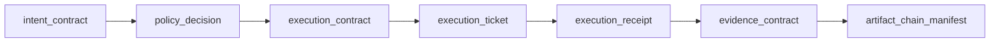

# SCL Artifact Guide

This guide explains the implemented SCLite artifacts in practical reviewer
language.

Current package: `sclite-core==1.0.10rc1`;
latest published public package: `sclite-core==1.0.9`.
The current integration front door is the review lifecycle
substrate: v0.2 lifecycle artifacts, v0.3 scoped ticket /
receipt-bounded-evidence checks, and v0.5 review-bundle packaging. Package
release labels and artifact schema versions are separate concepts.

The superseded proof-trace product path is retired after Ravenclaw public-proof
migration, not a current front door for new integrations. The `1.0.0`
line keeps those builders, validators, owned-only schemas, and fixture
directories out of the installed/current surface while freezing guarded
verification contracts. The `1.0.3` line completed audit-roadmap hardening.
The `1.0.4` line adds observation, finding, reaction-plan, escalation-proposal,
and reaction-chain contracts without interpreting or authorizing reactions.
The `1.0.6` line adds `trigger_decision.v0.1`, a bounded truth-layer
projection for trigger/event decisions that records event, rule, GovEngine
admission and optional child-operation references without making SCLite a
trigger engine, scheduler, policy authority or executor. The `1.0.5` line adds
typed-package metadata and quality gates without changing artifact semantics.
The `1.0.7` line adds `watchdog_decision.v0.1`, a bounded truth-layer
projection for RExecOp runtime-supervisor decisions without making SCLite a
worker supervisor, recovery authority, infrastructure monitor or scheduler.
The `1.0.8` line extends that artifact with optional bounded manual-recovery
context for GovEngine-admitted break-glass/recovery records.
The `1.0.9` line adds `automation_chain.v0.1` as the multi-step
automation-chain contract baseline: nodes, edges, GovEngine admission refs,
edge idempotency, depth/reaction budgets, recovery policy and LLM
proposal-only invariants, without making SCLite a traversal engine, scheduler,
policy authority, runtime or raw-evidence store.
The unpublished `1.0.10rc1` hotfix candidate preserves those contracts while
requiring verified snapshots, supported manifest identity/policy, explicit
scope assertions, and receipt timestamps inside ticket validity windows before
the relevant strict acceptance path can pass.

## Lifecycle map



## Current review-bundle surface

SCLite's current review-bundle surface packages the six lifecycle artifacts, an
artifact-chain manifest, reviewer Markdown, and a verification receipt into one
local/public-safe directory. The current stable release preserves the 0.5
review-bundle contract and adds public-truth and multi-fixture hardening around
it.

The fixture at `examples/review-bundle/` demonstrates the base shape and can be reviewed with:

```bash
python -m sclite.cli review examples/review-bundle --format json
python -m sclite.cli review examples/review-bundle --format summary
python -m sclite.cli export-review-bundle examples/review-bundle --format markdown
```

The bundled base fixture returns `review`, not `pass`, because it intentionally demonstrates the v0.2 lifecycle ticket rather than newer scoped `execution_ticket.v0.3` ticket-use semantics. That conservative verdict is part of the point: SCLite should make reviewer attention visible instead of overstating what a bundle proves.

The GovEngine integration fixture is expected to pass because it uses the v0.3 scoped-ticket / receipt-bounded-evidence surface and digest-bound profile sidecars:

```bash
python -m sclite.cli review examples/govengine-integration --format json --fail-on review
python -m sclite.cli validate-trust-profile examples/govengine-integration/trust_profile_ref.json --subject examples/govengine-integration/04_execution_ticket.json
python -m sclite.cli validate-carrier-profile examples/govengine-integration/carrier_profile_ref.json --subject examples/govengine-integration/04_execution_ticket.json
```

`examples/bad-review-bundle-cross-host/` intentionally fails review due to cross-role target drift and is used for negative integration tests.

## v0.3 scoped ticket surface

SCLite 0.3.5 publishes the first `ExecutionTicket` scoped-ticket surface while preserving SCLite's non-authority boundary. A scoped ticket can describe the runtime, target, tool, mode, normalized-argument digest, spend limits, and receipt/evidence obligations that an external runtime should enforce.

The fixture at `sclite/examples/scoped-ticket-v0.3/` demonstrates the shape and can be reviewed with:

```bash
python -m sclite.cli validate-ticket sclite/examples/scoped-ticket-v0.3/execution_ticket.json --contract sclite/examples/scoped-ticket-v0.3/execution_contract.json
python -m sclite.cli explain-ticket sclite/examples/scoped-ticket-v0.3/execution_ticket.json
```

This remains local/static validation. It does not prove legal authorization, signer identity, runtime enforcement, or live vulnerability evidence.

The 0.3.5 Receipt-Bounded Evidence slice adds `verify-ticket-use` for the same fixture:

```bash
python -m sclite.cli verify-ticket-use sclite/examples/scoped-ticket-v0.3/execution_ticket.json --contract sclite/examples/scoped-ticket-v0.3/execution_contract.json --receipt sclite/examples/scoped-ticket-v0.3/execution_receipt.json --evidence-contract sclite/examples/scoped-ticket-v0.3/evidence_contract.json
```

That verifier checks only local accountability bindings: receipt-to-ticket, receipt-to-contract, runtime/mode/network/use limits, evidence-to-receipt, evidence-to-ticket, explicit `source_receipt_id`, receipt-bounded claim flags, completed-execution/network claim bounds, and replay limits.

## v0.4 trust/carrier references and review records

SCLite includes digest-bound trust and carrier reference sidecars:

```bash
python -m sclite.cli validate-trust-profile \
  sclite/examples/trust-carrier-profiles/trust_profile_ref.json \
  --subject sclite/examples/scoped-ticket-v0.3/execution_ticket.json
python -m sclite.cli validate-carrier-profile \
  sclite/examples/trust-carrier-profiles/carrier_profile_ref.json \
  --subject sclite/examples/scoped-ticket-v0.3/execution_ticket.json
```

These checks validate sidecar shape and subject digest binding only. They do not prove signer identity, revocation state, delivery, adapter correctness, or authorization.

Lifecycle review records aggregate static lifecycle checks:

```bash
python -m sclite.cli review-lifecycle \
  sclite/examples/contract-lifecycle-v0.2/artifact_chain_manifest.json \
  --format json
```

The output is a `review_record.v0.1` with conservative `pass` / `review` / `fail` verdicts. Review records are also used as review-bundle verification receipts.

## v0.2 lifecycle map

| Artifact | File in example | Schema-backed? | Built/validated by this package? |
| --- | --- | --- | --- |
| `IntentContract` | `sclite/examples/contract-lifecycle-v0.2/intent_contract.json` | Yes | Validated |
| `PolicyDecision` v0.2 | `sclite/examples/contract-lifecycle-v0.2/policy_decision.json` | Yes | Validated |
| `ExecutionContract` | `sclite/examples/contract-lifecycle-v0.2/execution_contract.json` | Yes | Validated |
| `ExecutionTicket` | `sclite/examples/contract-lifecycle-v0.2/execution_ticket.json` | Yes | Validated; integrity-bound |
| `ExecutionReceipt` v0.2 | `sclite/examples/contract-lifecycle-v0.2/execution_receipt.json` | Yes | Validated |
| `EvidenceContract` | `sclite/examples/contract-lifecycle-v0.2/evidence_contract.json` | Yes | Validated |
| `ArtifactChainManifest` | `sclite/examples/contract-lifecycle-v0.2/artifact_chain_manifest.json` | Yes | Verified by `sclite validate-chain` / `sclite verify-lifecycle` |
| `KernelGuardManifest` | optional sidecar, `kernel_guard_hmac_v1.schema.json` | Optional | Verified by `sclite verify-guarded-chain` when a local HMAC key is supplied |

The v0.2 integrity model is deliberately lightweight: canonical SHA-256
descriptors plus an ordered hash-linked chain. `validate-chain` verifies local
chain integrity; `verify-lifecycle` additionally requires the exact canonical
lifecycle role sequence with no extra or duplicate roles. Lifecycle semantics
then check policy->intent binding, execution contract->intent/policy binding,
ticket->execution contract binding, and receipt/evidence bindings. Manifest
path containment is part of both generic chain validation and strict lifecycle
verification. It detects local bundle tampering and lifecycle-link drift, but
it does not prove signer identity, legal authorization, runtime enforcement,
replay freshness, or
transparency-log inclusion.

The optional Kernel Guard sidecar adds HMAC-SHA256 authenticity inside a
GovEngine/KERNEL secret domain. It binds existing manifest entries and manifest
metadata without changing artifact bodies. It is not public PKI and does not
handle replay without an external replay store.

## Reaction evidence artifacts

The `1.0.4` line added the reaction evidence boundary for deterministic
automation:

| Artifact | Schema | Owner of semantics |
| --- | --- | --- |
| `ObservationEnvelope` | `observation_envelope.v0.1` | profile/runtime observation facts |
| `Finding` | `finding.v0.1` | profile taxonomy and severity semantics |
| `ReactionPlan` | `reaction_plan.v0.1` | RExecOp deterministic reaction planning plus GovEngine admission result |
| `EscalationProposal` | `escalation_proposal.v0.1` | untrusted advisory proposal only |

SCLite validates and binds these artifacts by canonical descriptors. The
reaction chain verifier accepts:

```text
observation -> finding -> reaction_plan
observation -> finding -> reaction_plan -> execution_receipt
```

It checks that finding and reaction-plan links bind to the expected artifact
descriptors. It does not interpret profile reaction rules, choose child
operations, authorize policy, call an LLM, or execute a remediation.

## Trigger decision artifacts

The `1.0.6` line added `trigger_decision.v0.1` for event/trigger decisions.
The artifact records:

- event reference and payload digest;
- rule-set and optional rule references;
- GovEngine admission digest/outcome;
- decision such as `plan_operation`, `ignore`, `escalate`,
  `drop_duplicate`, or `cooldown_blocked`;
- optional child operation reference for admitted `plan_operation` decisions.

SCLite enforces only the bounded truth shape. A `plan_operation` decision must
carry an allowed admission and an operation reference; non-planning decisions
cannot carry an operation reference. Event matching, dedupe, cooldown,
scheduling, and child-operation creation remain RExecOp responsibilities.

## Watchdog decision artifacts

The `1.0.7` line added `watchdog_decision.v0.1`, and `1.0.8` extended it with
optional `manual_recovery` context. The artifact records:

- watchdog observation reference and digest;
- GovEngine admission digest/outcome;
- affected operation, event, trigger, or inbox item reference;
- decision such as `record_health`, `renew_lease`, `mark_stale`,
  `move_to_dead_letter`, `retry_later`, `escalate_operator`, or
  `block_autostart`;
- optional manual recovery actor/scope/signoff context for admitted recovery
  or break-glass records.

SCLite enforces the local record shape and non-claims. Recovery decisions that
change operation handling require allowed GovEngine admission, and selected
manual paths require bounded manual-recovery context. SCLite still does not
supervise workers, run retries, authorize recovery, interpret infrastructure
health, or execute operations.

## Artifact hash descriptor

SCLite can emit a deterministic SHA-256 descriptor for any JSON-compatible artifact:

```bash
sclite hash-artifact --schema execution_contract.v0.2 examples/review-bundle/03_execution_contract.json
```

The helper canonicalizes JSON with sorted keys, compact separators, preserved Unicode, and UTF-8 bytes, then hashes those bytes with SHA-256. The descriptor is useful for content addressing, fixture comparison, and lightweight reviewer references.

It is not a signature, identity proof, authorization proof, or tamper-proof audit chain. A runtime that needs provenance must add signing/identity controls outside this helper.


## RedactionPolicy and RedactionReceipt

`RedactionPolicy` documents public-safe redaction rules. `RedactionReceipt` records a redaction operation using policy/source/redacted hashes and summary counts while excluding raw source material.

They are useful for reviewer traceability, but they are not a complete secret scanner, not proof that upstream data never contained secrets, and not publication authorization.

The redaction helpers are blacklist-oriented public-safe fixture helpers. Treat them as part of publication hygiene, not as DLP or a general-purpose secret scanner.

## PublicValidationSurfaceIndex and PublicSnapshotManifest

`PublicValidationSurfaceIndex` lists public-safe validation surfaces and commands. `PublicSnapshotManifest` describes selected public-safe files and can include SCLite canonical hash descriptors.

These artifacts help reviewers understand what can be validated locally. They do not claim live execution, protocol adapter coverage, signed provenance, or push/package publication authorization.

## ScopeFidelityReport

A `ScopeFidelityReport` is a static host-binding review artifact.

It can answer: “does this execution shape appear to target the same host as the declared target?”

It returns:

- `pass` when detected hosts match;
- `review` when no host can be detected;
- `fail` when a different host appears.

It is deliberately conservative. `review` is not a failure; it means a human/system should inspect a shape where the simple static detector cannot infer host binding.

## How to review the example fixture

Run:

```bash
python -m sclite.cli validate-chain sclite/examples/contract-lifecycle-v0.2/artifact_chain_manifest.json
python -m sclite.cli verify-lifecycle sclite/examples/contract-lifecycle-v0.2/artifact_chain_manifest.json
python -m sclite.cli review examples/review-bundle --format json
python -m sclite.cli export-review-bundle examples/review-bundle --format markdown
python -m sclite.cli review-lifecycle sclite/examples/contract-lifecycle-v0.2/artifact_chain_manifest.json --format json
python -m sclite.cli validate-trust-profile sclite/examples/trust-carrier-profiles/trust_profile_ref.json --subject sclite/examples/scoped-ticket-v0.3/execution_ticket.json
python -m sclite.cli validate-carrier-profile sclite/examples/trust-carrier-profiles/carrier_profile_ref.json --subject sclite/examples/scoped-ticket-v0.3/execution_ticket.json
python -m sclite.cli validate-artifact --schema scope_fidelity_report.v0.1 examples/scope-fidelity-report/scope_fidelity_report.json
python -m sclite.cli hash-artifact --schema execution_contract.v0.2 examples/review-bundle/03_execution_contract.json
python -m sclite.cli validate-artifact --schema redaction_policy.v0.1 examples/redaction-policy/redaction_policy.json
python -m sclite.cli validate-artifact --schema redaction_receipt.v0.1 examples/redaction-receipt/redaction_receipt.json
python -m sclite.cli validate-artifact --schema public_validation_surface_index.v0.1 examples/public-validation-surface-index/public_validation_surface_index.json
python -m sclite.cli validate-artifact --schema public_snapshot_manifest.v0.1 examples/public-snapshot-manifest/public_snapshot_manifest.json
python -m sclite.cli scope-fidelity --target https://example.com/login --normalized-arg https://example.com/login --fail-on review
```

A passing result means the local synthetic fixture matches the current schemas/invariants. It does not mean the project executed tools or found a vulnerability.
