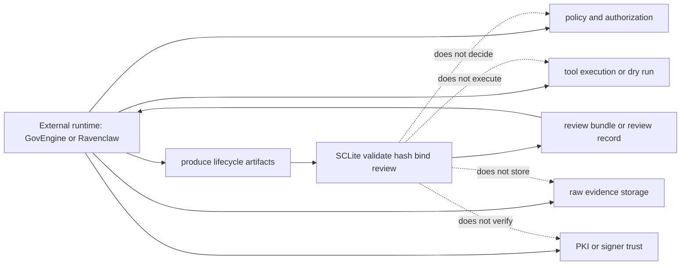

# Integration Guide

This guide is for runtimes, CLIs, CI jobs, or carrier adapters that want to use SCL artifacts.

SCLite is centered on the v0.2 contract lifecycle. The current 0.8 beta
release freezes the 0.5 review-bundle contract as the integration front
door, retains deterministic review-bundle materialization for active
consumers, and retains scoped-ticket checks, receipt-bounded-evidence checks,
trust/carrier references, lifecycle review records, public truth validation,
and public-safe fixtures on top of that lifecycle:

```text
intent_contract -> policy_decision -> execution_contract -> execution_ticket -> execution_receipt -> evidence_contract -> artifact_chain_manifest
```

SCL core is intentionally small. It provides schemas, validation helpers, redaction helpers, Scope Fidelity review, lifecycle integrity verification, review-bundle packaging, public-safe fixtures, and a CLI. It does not provide a policy gateway, approval system, executor, sandbox, trust authority, or carrier adapter.

## Runtime boundary



## Recommended boundary

Keep these responsibilities outside SCL core:

- user/operator identity;
- scope program loading;
- policy evaluation;
- tool allowlists;
- approval authority;
- execution isolation;
- evidence storage;
- carrier transport;
- public publication flow.

Use SCL for the artifact boundary between those responsibilities.

## Reference flow

A governed runtime can use SCLite like this:

1. **Receive intent**
   - Runtime receives a target/objective/task.
   - Runtime emits or maps that request into `IntentContract`.
   - Intent is not authority.

2. **Evaluate policy**
   - Runtime policy code decides whether preparing execution is allowed.
   - Runtime emits `PolicyDecision` v0.2 bound to the intent descriptor.

3. **Prepare execution contract**
   - Runtime compiles a concrete bounded execution shape.
   - Runtime emits `ExecutionContract` with target binding, tool, normalized args, and execution bounds.

4. **Approve execution ticket**
   - Reviewer/auditor/owner policy approves or rejects the execution contract.
   - Runtime emits `ExecutionTicket` bound to the exact execution contract digest, with approval status, validity, and execution limits.

5. **Execute or dry-run**
   - Runtime executor consumes its own approved/ticketed shape.
   - SCLite does not execute it.
   - Runtime emits `ExecutionReceipt` v0.2 bound to the ticket.

6. **Verify ticket use / evidence bounds**
   - For the published v0.3 scoped-ticket fixture, reviewers can run `sclite verify-ticket-use`.
   - The check verifies local bindings only: ticket/contract/receipt/evidence descriptors, runtime identity, mode, network flag, use count, explicit `source_receipt_id`, completed-execution claim bounds, and network/live claim bounds.
   - The check does not prove runtime enforcement, legal authorization, signer identity, or live vulnerability evidence.

7. **Emit evidence contract**
   - Runtime emits `EvidenceContract` with claims, non-claims, replay mode, verification commands, and a link to the receipt.
   - Claims that depend on a receipt should declare `bounded_by_receipt: true` and `source_receipt_id`.
   - Public outputs should keep raw private evidence elsewhere.

8. **Build and verify lifecycle chain**
   - Runtime builds `ArtifactChainManifest`.
   - CI/reviewer runs `sclite validate-chain` or `sclite verify-lifecycle`.
   - The verifier checks path containment, artifact digests, hash-chain links, role order, and the key lifecycle bindings, including receipt-to-contract and evidence-to-ticket links.

9. **Package a review bundle**
   - Runtime or CI places the six lifecycle artifacts, manifest, reviewer Markdown, and verification receipt in the canonical review-bundle shape.
   - Reviewer runs `sclite review examples/review-bundle --format json` or exports Markdown with `sclite export-review-bundle`.
   - Bundle review remains local/static: it does not execute tools, authorize work, prove signer identity, or verify carrier delivery.

The superseded proof-trace product path (`PreparedExecutionSpec`, `ApprovedExecutionSpec`, legacy receipt/evidence builders, and fixture validation CLI) is retired after consumer migration; it is not an installed/current surface claim.

## Minimal Python integration

Verify a v0.2 lifecycle bundle:

```python
from pathlib import Path

from sclite.integrity import verify_artifact_chain_manifest

# manifest is artifact_chain_manifest.json loaded as a dict.
result = verify_artifact_chain_manifest(manifest, root=Path("bundle-root"))
assert result["status"] == "passed"
assert "ticket_binds_execution_contract" in result["semantic_checks"]
```

Verify published scoped-ticket use against receipt/evidence artifacts:

```python
from sclite.tickets import validate_ticket_semantics, verify_ticket_use

validate_ticket_semantics(ticket, execution_contract)
result = verify_ticket_use(ticket, execution_contract, execution_receipt, evidence_contract)
assert result["status"] == "passed"
assert "evidence_claims_bounded_by_receipt" in result["checks"]
```

Review a canonical v0.5 bundle:

```python
from sclite.bundles import review_bundle

record = review_bundle("examples/govengine-integration")
assert record["artifact_type"] == "review_record"
assert record["verdict"] == "pass"
```

For GovEngine, treat [`GOVENGINE_INTEGRATION_CONTRACT.md`](GOVENGINE_INTEGRATION_CONTRACT.md) as the stable import/CLI contract for `sclite-core>=0.8.0b2,<0.9`. Use [`CLI_EXIT_CODES.md`](CLI_EXIT_CODES.md) for CI thresholds.

## Carrier guidance

A carrier is anything that transports or triggers the workflow: a chat bot, OpenClaw plugin, MCP server, API endpoint, CI job, queue worker, or custom UI.

Good carrier behavior:

- preserve SCL artifacts as structured JSON;
- avoid flattening approvals into chat text only;
- keep non-claims visible;
- keep public-safe and private artifacts separated;
- require explicit approval before execution or publication;
- treat validation receipts as evidence of checks, not authorization.

Bad carrier behavior:

- treating a model message as executable authority;
- dropping target/scope facts;
- hiding approval source or constraints;
- publishing raw private evidence by default;
- Do not claim Scope Fidelity proves legal authorization.
- Do not claim a validation receipt authorizes public push.

## Endpoint shape for a future engine

A carrier-agnostic engine that consumes SCLite could expose endpoints such as:

- `POST /intent` -> `IntentContract`
- `POST /policy/decide` -> `PolicyDecision` v0.2
- `POST /execution/contract` -> `ExecutionContract`
- `POST /execution/ticket` -> `ExecutionTicket`
- `POST /execution/receipt` -> `ExecutionReceipt` v0.2
- `POST /evidence/contract` -> `EvidenceContract`
- `POST /artifacts/chain` -> `ArtifactChainManifest`
- `POST /review/bundle` -> review-bundle package/review result
- `POST /artifacts/hash` -> canonical SHA-256 descriptor
- `POST /redaction/policy` -> `RedactionPolicy`
- `POST /redaction/receipt` -> `RedactionReceipt`
- `POST /public/validation-surface-index` -> `PublicValidationSurfaceIndex`
- `POST /public/snapshot-manifest` -> `PublicSnapshotManifest`

Those endpoints are not implemented in this repository. They are an integration direction for a separate engine package or runtime.

## Security notes

SCL validation is not enough for safe execution. A production system still needs real controls around:

- authentication and authorization;
- target/scope ownership;
- command construction;
- sandboxing;
- secrets management;
- output redaction;
- audit logging;
- rollback/kill switches;
- human approval gates.

SCL makes those controls easier to review because it gives them structured artifacts to produce and consume.
