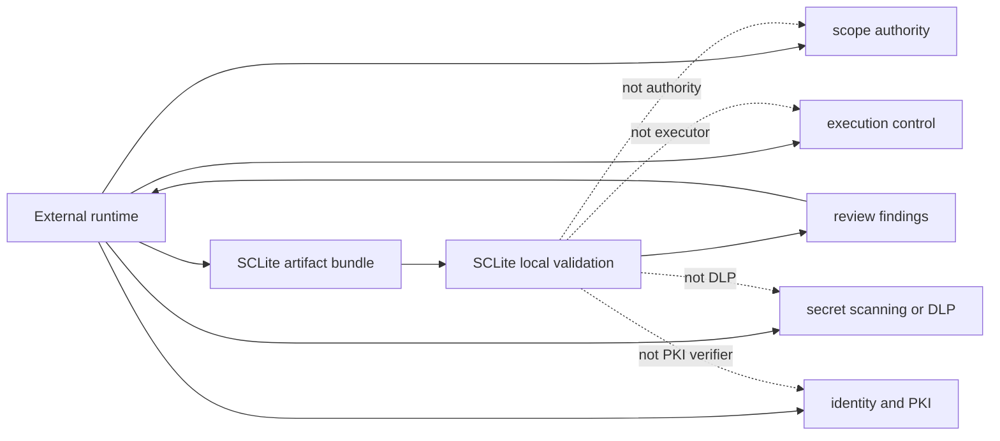

# SCLite Threat Model

SCLite is a local artifact validation and review package. It helps reviewers detect drift and tampering in public-safe lifecycle artifacts, but it is not a runtime authority.

## Assets

- lifecycle JSON artifacts;
- canonical SHA-256 artifact descriptors;
- ordered artifact-chain manifests;
- scoped execution tickets;
- receipt-bounded evidence contracts;
- review records and review bundles;
- optional `kernel_guard_hmac_v1` sidecars;
- public-safe fixtures and Markdown exports.

## Attacker Capabilities Considered

SCLite is designed to help detect:

- modified lifecycle artifacts after review;
- digest mismatch inside an artifact-chain manifest;
- extra, duplicate, or reordered roles in strict lifecycle verification;
- lifecycle binding drift, such as a ticket bound to a different execution contract;
- receipt/evidence overclaiming relative to linked ticket or receipt artifacts;
- simple cross-role target drift visible in explicit host fields;
- malformed review bundles or missing canonical files.

## Out Of Scope

SCLite does not detect or enforce:

- legal authorization or scope ownership;
- DNS, redirects, wildcard scope, CIDR/IP ranges, IPv6, IDN/punycode, eTLD+1, port policy, localhost/private-network policy, or URL canonicalization edge cases;
- runtime command construction safety;
- sandbox behavior;
- raw evidence storage safety;
- complete secret scanning or DLP;
- signer identity, revocation, transparency logs, PKI, or Sigstore verification;
- authenticity claims from `signature_policy` metadata unless an external
  verifier validates a real signature or guard;
- replay of an old but otherwise valid integrity-only bundle;
- forged complete chains when an attacker controls every artifact and manifest
  before any external signature, guard, or anchor is applied;
- HMAC key compromise for guarded bundles;
- replay of an old guarded bundle unless an external GovEngine/runtime replay
  store rejects the `root_tag` or chain/run identifier;
- carrier delivery or protocol correctness;
- malicious external runtimes that ignore SCLite artifacts.

## Trust Boundary

## Security Posture

SCLite improves reviewability by making artifacts small, schema-shaped, hash-bound, and explicit about non-claims. It should be paired with a runtime such as GovEngine or Ravenclaw for policy enforcement, execution controls, identity verification, redaction strategy, and evidence handling.
